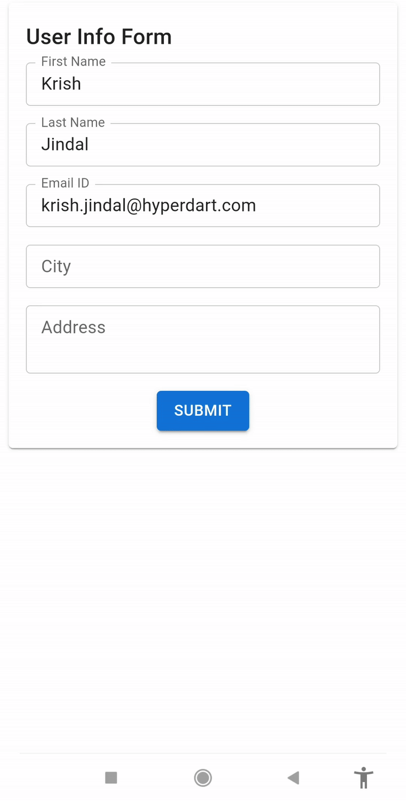
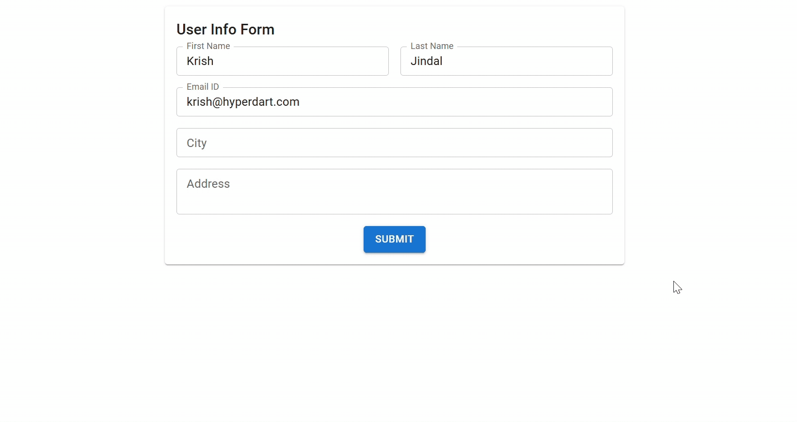

#  ResponsiveAutocomplete

A responsive React component that mimics Material-UI's Autocomplete and adapts to **mobile** with a full-screen Experience for a better UX.

---

## ✨ Features
- ✅ Support Mutiple MUI version (4,5 & 6)
- ✅ Responsive Design – switches between standard and fullscreen layouts automatically  
- ✅ Mobile Optimization – mobile version takes full screen for better mobile experience
- ✅ Customizable Back Button & Layout – add styles with optional classNames
- ✅ Fully Compatible with MUI v4 Autocomplete – just swap your import, and it works
- ✅ Zero breaking changes: use it exactly like `<Autocomplete>`

---

## Components
 There are 2 components that can be used from this package
- `Autocomplete` for muiv5 and muiv6 versions
- `AutocompleteV4` for muiv4 version

##  Getting Started

```bash

# 1. Install dependencies
npm install

# 2. Start the development server
npm start
```

> Do the same thing in both the main and example folders.

## Mobile View
<p align="center">

</p>

## Desktop View
<p align="center">

</p>

## ⚙️ Props

### Autocomplete
All standard props from `MUI v5/v6 Autocomplete` are supported.

| Prop                  | Type       | Description |
|-----------------------|------------|-------------|
| `mobilebackgroundClassName`  | string     | Optional class added to the fullscreen container on mobile |
| `backButtonClassName` | string     | Optional class added to the back <IconButton> shown in mobile fullscreen |
| `mobileBackgroundSx`  | object     | Optional sz added to the fullscreen  container on mobile |
| `backButtonSx` | object     | Optional sx added to the back <IconButton> shown in mobile fullscreen |

### AutocompleteV4
All standard props from `MUI v5/v6 Autocomplete` are supported.
| Prop                  | Type       | Description |
|-----------------------|------------|-------------|
| `mobilebackgroundClassName`  | string     | Optional class added to the fullscreen <div> container on mobile |
| `backButtonClassName` | string     | Optional class added to the back <IconButton> shown in mobile fullscreen |


## Customization Tips
- Use mobileDivClassName to tweak mobile fullscreen layout

- Use backButtonClassName to position or restyle the back button

- Override PopperComponent prop if you need custom dropdown behavior